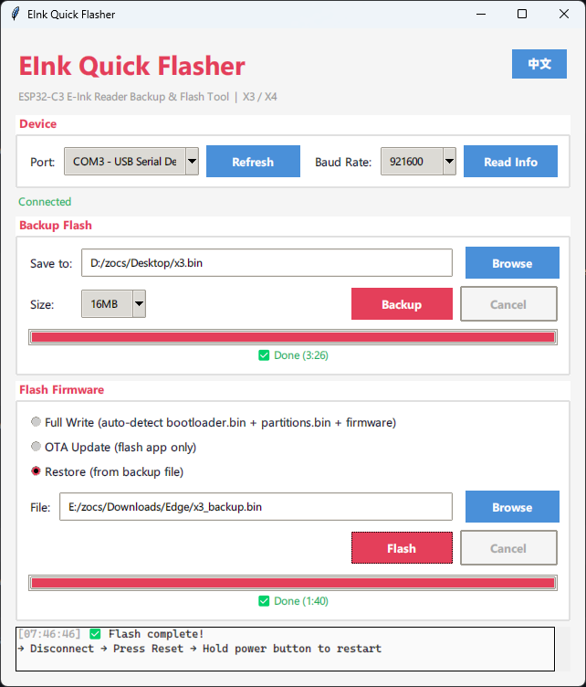

# EInk Quick Flasher

A fast backup and flashing tool for ESP32-C3 e-ink readers.

Supported devices: xteink X3, X4

[中文](README.md) | [📖 Guide](X3-FLASHER-GUIDE.md)



## Features

- Uses esptool subprocess for backup and flash — same speed as command line
- Standalone exe — no Python or dependencies needed
- Auto-detect COM port, read device info
- Supports both X3 and X4 devices
- Flash backup (1/4/8/16MB) with cancel support
- Firmware flash (full write / OTA update / restore) with risk confirmation
- Real-time progress bar for both backup and flash
- Bilingual UI (Chinese / English) with one-click toggle
- Modern light theme

> ⚠️ **X4 Support Note**: After analyzing the X4 firmware with binwalk, its partition layout is fully compatible with esptool, so X4 backup/flash should work in theory. Testing has only been done on X3; X4 has not been verified with actual hardware. X4 users — feedback welcome!

## Usage

Download `EInk-Quick-Flasher.exe` from [Releases](../../releases). No installation needed.

### Connection

- **X3**: Hold power button → connect magnetic pogo cable → COM port detected
- **X4**: Hold power button → connect USB-C cable → COM port detected

### Backup

1. Select port → click "Read Info" to confirm
2. Choose save path and size
3. Click "Backup"

### Flash

- **Full write**: bootloader.bin, partitions.bin, firmware.bin must be in the same directory
- **OTA update**: flash app partition only
- **Restore**: select backup file. Stock firmware in `firmware/` directory. CN/EN designation only indicates default UI language — firmware content is identical, language can be switched in settings.

| File | Description |
|---|---|
| x3_cn_v5.2.13_full.bin | X3 V5.2.13 (Chinese, full backup 16MB) |
| x3_en_v5.2.13_full.bin | X3 V5.2.13 (English, full backup 16MB) |
| x3_en_v1.0.7_full.bin | X3 V1.0.7 (English, full backup 16MB) |
| x4_cn_v5.2.13_ota.bin | X4 V5.2.13 (Chinese, OTA 6MB) |
| x4_en_v5.1.6_ota.bin | X4 V5.1.6 (English, OTA 6MB) |

## Partition Table

When flashing CrossPoint, both X3 and X4 use the same partition layout (provided by CrossPoint, verified):

| Partition | Offset | Size |
|---|---|---|
| nvs | 0x9000 | 20KB |
| otadata | 0xE000 | 8KB |
| app0 | 0x10000 | 6.25MB |
| app1 | 0x650000 | 6.25MB |
| spiffs | 0xC90000 | 3.37MB |
| coredump | 0xFF0000 | 64KB |

First-time CrossPoint flash requires full write (bootloader + partition table + app). Subsequent updates can use OTA.

`_full` files are official full backups (16MB) containing bootloader + partition table + app + data. Write from address 0x0.

`_ota` files are official OTA firmware (~6MB) containing app partition only. Requires original partition table (device must be running official firmware).

## Build from source

```powershell
pip install pyserial esptool
python main.py
```

## Related

- [CrossPoint Reader](https://github.com/crosspoint-reader/crosspoint-reader) — Open-source e-reader firmware
- [CrossPoint Reader (X3 beta)](https://github.com/itsthisjustin/crosspoint-reader) — X3 port by itsthisjustin (testing)
- [crosspoint-chinesetype](https://github.com/icannotttt/crosspoint-chinesetype) — Chinese localization for CrossPoint
- [xteink-flasher](https://github.com/crosspoint-reader/xteink-flasher) — Web-based flasher

## Disclaimer

This tool is for educational research and personal use only, shared freely for user convenience. Flashing firmware carries inherent risks including but not limited to device failure, data loss, or abnormal hardware behavior. Users assume all risks and bear full responsibility for any consequences. The developer is not liable for any direct or indirect damages resulting from the use of this tool, and reserves the right to modify or discontinue it at any time.

## License

MIT
