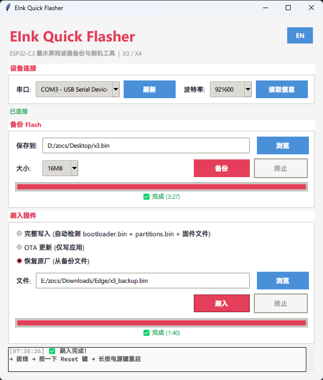

# EInk Quick Flasher

ESP32-C3 墨水屏阅读器快速备份与刷机工具

支持设备：xteink 阅星瞳 X3、X4

[English](README-EN.md) | [📖 刷机指南](X3-FLASHER-GUIDE.md)



## 特点

- 🚀 备份和刷机均使用 esptool 子进程，速度与命令行一致
- 📦 单文件 exe，无需安装 Python 或其他依赖
- 🔌 自动检测 COM 口，读取设备信息
- ⚡ 支持 X3 和 X4 设备
- 📦 Flash 备份（1MB / 4MB / 8MB / 16MB），支持终止
- ⚡ 固件刷入（完整写入 / OTA 更新 / 恢复原厂），带风险确认
- 📋 实时进度条，备份和刷入均显示进度
- 🌐 中英文双语界面，一键切换
- 🎨 现代浅色主题

## 使用

### 下载

从 [Releases](../../releases) 下载 `EInk-Quick-Flasher.exe`，双击运行。

### 连接设备

- **X3**：长按电源键开机 → 接上 4 触点磁吸线 → 识别到 COM 口
- **X4**：长按电源键开机 → USB-C 连接 → 识别到 COM 口

### 备份

1. 选择串口 → 点击「读取信息」确认连接
2. 选择保存路径和大小
3. 点击「备份」

### 刷入

- **完整写入**：bootloader.bin、partitions.bin、firmware.bin 需在同一目录，选择 firmware.bin 自动检测
- **OTA 更新**：仅更新应用分区，选择 firmware.bin
- **恢复原厂**：选择完整备份文件。本仓库 `firmware/` 目录提供官方固件备份。CN/EN 标注仅为默认界面语言不同，固件内容完全一致，刷入后可在设置中切换语言。

| 文件 | 说明 |
|---|---|
| x3_cn_v5.2.13_full.bin | X3 V5.2.13（默认中文，完整备份 16MB） |
| x3_en_v5.2.13_full.bin | X3 V5.2.13（默认英文，完整备份 16MB） |
| x3_en_v1.0.7_full.bin | X3 V1.0.7（默认英文，完整备份 16MB） |
| x4_cn_v5.2.13_ota.bin | X4 V5.2.13（默认中文，OTA 6MB） |
| x4_en_v5.1.6_ota.bin | X4 V5.1.6（默认英文，OTA 6MB） |

## 分区表

### CrossPoint 固件

X3 和 X4 刷 CrossPoint 时，使用 CrossPoint 自带的分区表（两者相同，已验证）：

| 分区 | 偏移 | 大小 |
|---|---|---|
| nvs | 0x9000 | 20KB |
| otadata | 0xE000 | 8KB |
| app0 | 0x10000 | 6.25MB |
| app1 | 0x650000 | 6.25MB |
| spiffs | 0xC90000 | 3.37MB |
| coredump | 0xFF0000 | 64KB |

首次刷入需完整写入（bootloader + 分区表 + app），因为原厂分区布局与 CrossPoint 不同。之后可用 OTA 更新。

### 官方固件

`_full` 为官方全备份固件（16MB），包含 bootloader + 分区表 + 应用 + 数据，直接从 0x0 写入即可，无需关心分区布局。

`_ota` 为官方 OTA 固件（~6MB），仅包含应用分区，需配合原厂分区表使用（即设备当前运行的是官方固件）。

## 从源码构建

```powershell
pip install pyserial esptool
python main.py
```

打包 exe：

```powershell
pip install pyinstaller
pyinstaller --onefile --windowed --name "EInk-Quick-Flasher" --hidden-import esptool --hidden-import serial --collect-all esptool main.py
```

## 相关项目

- [CrossPoint Reader](https://github.com/crosspoint-reader/crosspoint-reader) - 开源墨水屏阅读器固件
- [CrossPoint Reader (X3 测试版)](https://github.com/itsthisjustin/crosspoint-reader) - itsthisjustin 的 X3 移植分支（测试中）
- [crosspoint-chinesetype](https://github.com/icannotttt/crosspoint-chinesetype) - CrossPoint 中文汉化版（含 OTA 固件下载）
- [xteink-flasher](https://github.com/crosspoint-reader/xteink-flasher) - 网页版刷机工具

## 免责声明

本工具仅供学习交流和个人使用，基于友好分享、便捷刷机和开源精神制作。本项目为非盈利项目，旨在方便众多用户进行固件刷写，免费分享。使用本工具刷写设备固件存在风险，包括但不限于设备无法启动、数据丢失等。使用者需自行评估风险并承担使用本工具导致的一切后果。开发者不对因使用本工具造成的任何损失负责。

## License

MIT
